## Overview

# Schola₹Shopy: A Second-Hand Marketplace for College Students

## Project Overview
**Schola₹Shopy** The Student Marketplace Platform is a comprehensive solution designed to facilitate the buying and selling of second-hand items among students. The platform provides secure and efficient functionalities for users to list, search, and purchase items, ensuring a seamless user experience.

## Features

<!-- 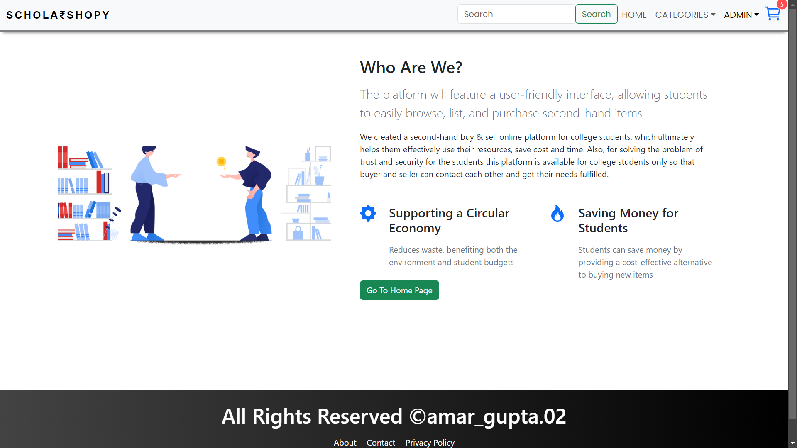 -->
<!-- 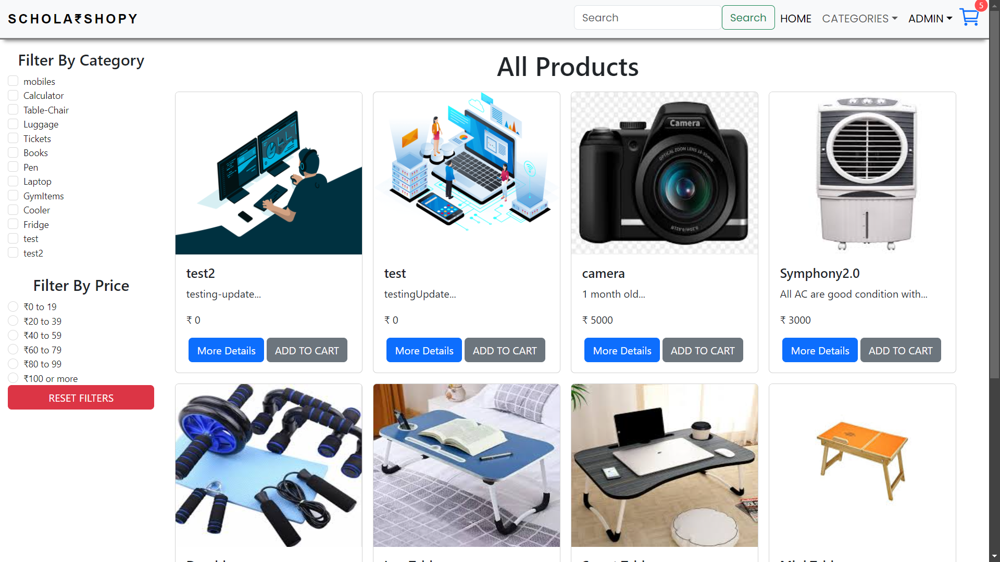 -->
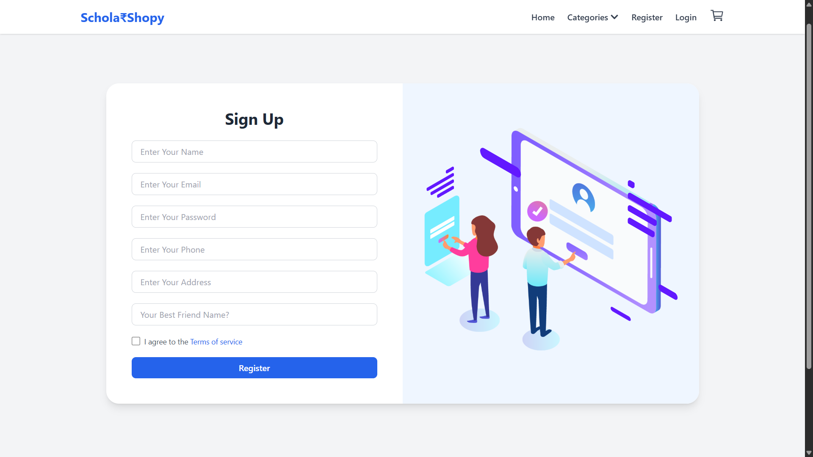
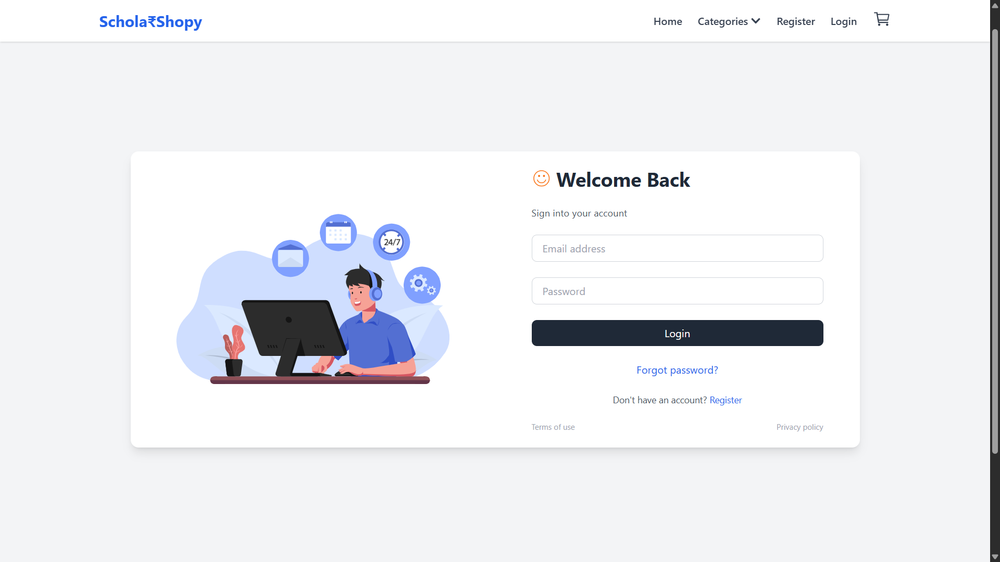

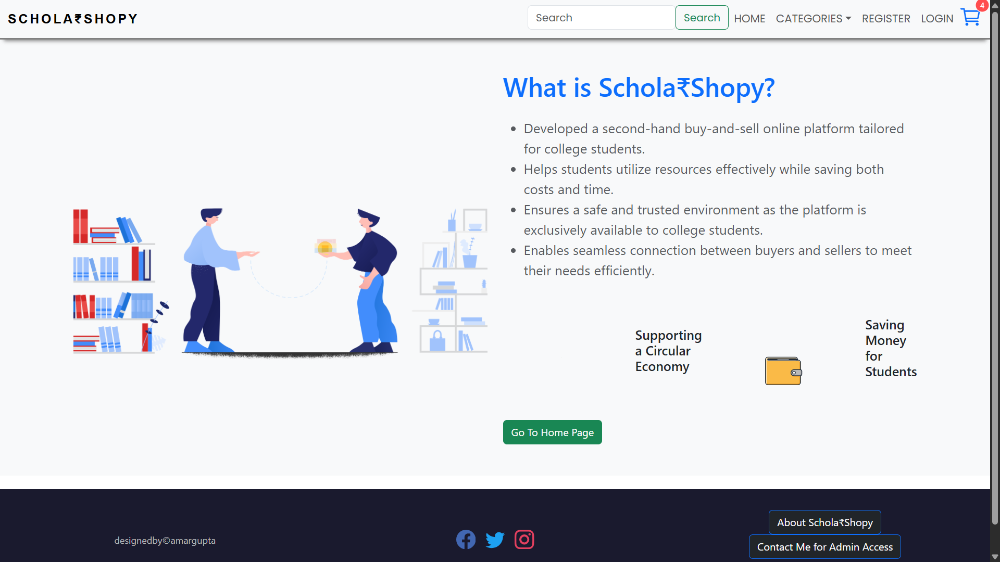
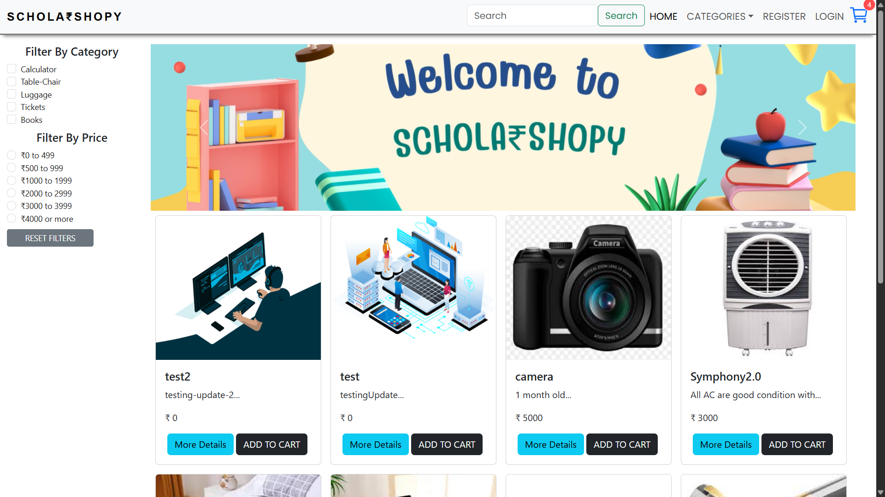
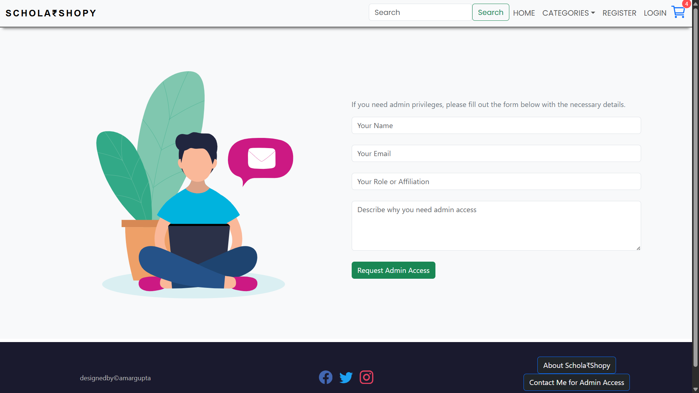


<!-- 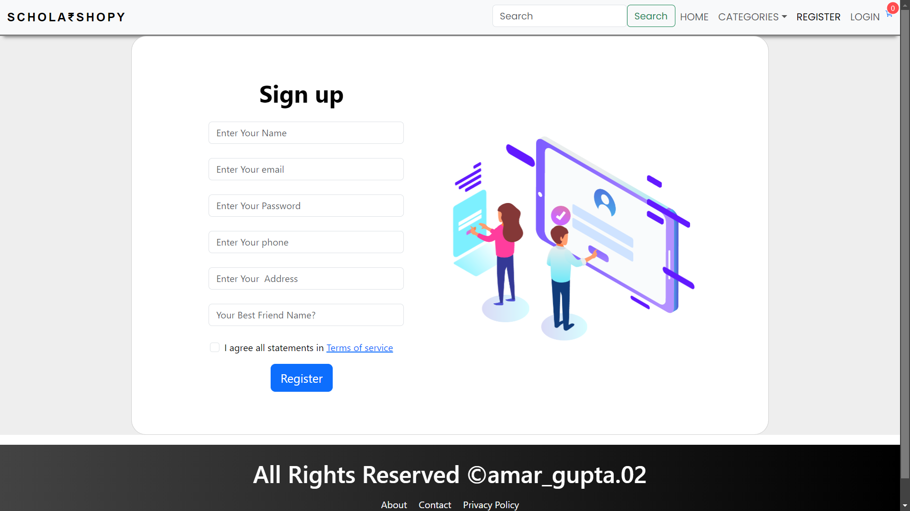 -->
<!--  -->
<!--  -->

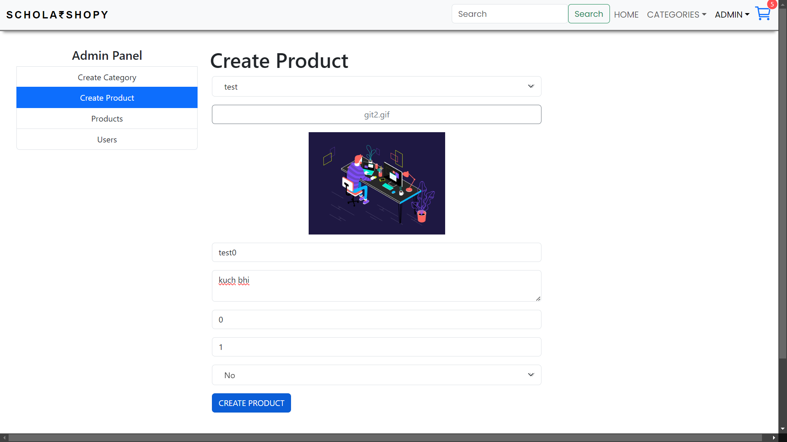
<!--  -->
<!--  -->
<!--  -->
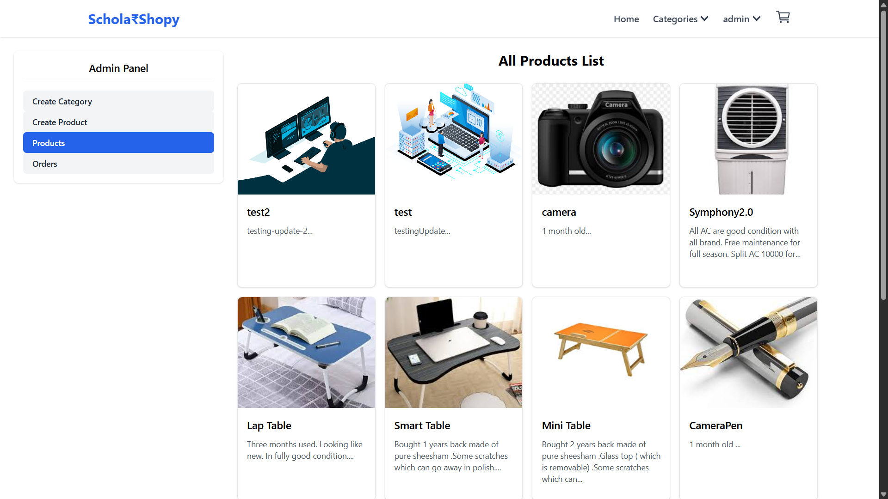
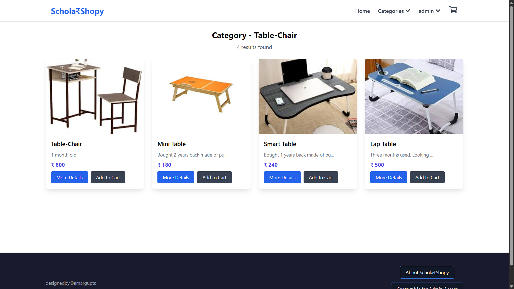
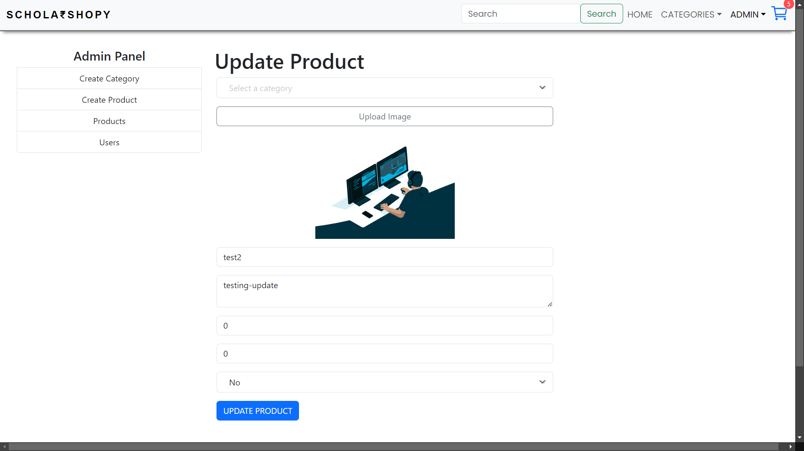
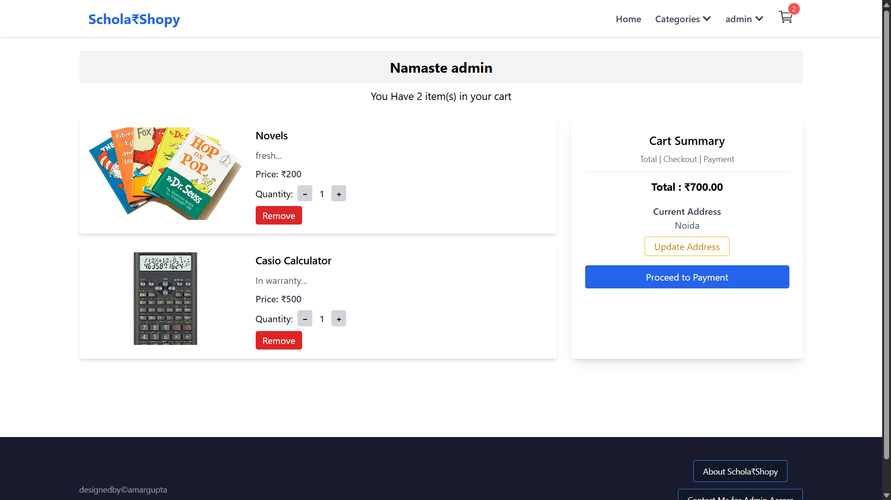
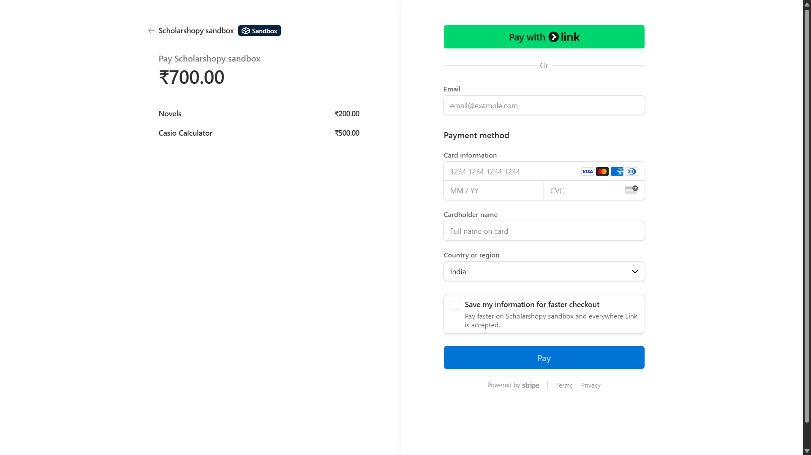
<!--  -->
<!--  -->


### User Authentication and Security
- **JWT**: Maintains secure sessions with JSON Web Tokens.
- **SSL/TLS Encryption**: Ensures all data exchanged between client and server is encrypted.
- **Bcrypt**: Passwords are hashed for added security.


### User and Admin Dashboards
- **User Dashboards**: Allow users to manage their orders, profiles, and inventory.
- **Admin Dashboards**: Enable administrators to manage orders, profiles, inventory, and perform other administrative tasks, enhancing platform management and user experience.

### Seamless Shopping Experience
- **User Authentication**: Secure login and session management.
- **Product Management**: Efficient handling of product listings and inventories.
- **Secure Payment Gateways**: Safe and secure transaction processing.

## Future Scope
- **Expand API Integrations**: Explore additional APIs to enhance data and service offerings.
- **Mobile Application**: Develop a mobile app to provide on-the-go access to the platform.
- **Enhanced Security Features**: Implement advanced security measures to further protect user data and transactions.
- **Additional Payment Gateways**: Integrate more payment gateways to offer users a variety of transaction options.

## Technical Stack
### **Frontend**
- React.js: Responsive and dynamic user interface.
- Context API: Efficient state management.

### **Backend**
- Node.js with Express: RESTful APIs and server logic.
- MongoDB: Flexible and scalable data storage.

### **Integration (Future Scope)**
- Razorpay API: Secure payment gateway.
- Google Maps API: Geolocation for better usability.
- Machine Learning Models: For personalized recommendations and inventory analytics.


## Societal Impact
- **Sustainability**:
  - Reducing waste by promoting reuse.
  - Lowering environmental pollution and resource consumption.
- **Economic Benefits**:
  - Cost-saving options for students.
  - Contribution to a circular economy.


## Getting Started
To get a local copy up and running, follow these simple steps.

### Prerequisites
- Node.js
- MongoDB


---

## ✅ Overall Payment Flow

### 🧠 Summary:

1. Frontend sends the cart to your backend.
2. Backend uses the cart to create a Stripe Checkout **session**.
3. Backend sends the session ID back.
4. Frontend uses that session ID to redirect the user to **Stripe-hosted payment page**.
5. Stripe handles payment and redirects user to your success/cancel URLs.

---

## 🔁 Step-by-Step Breakdown

---

### 🟢 1. **Frontend triggers checkout**

#### Code:

```js
const { data } = await axios.post(
  `${process.env.REACT_APP_API}/api/v1/product/payment`,
  { cart },
  { headers: { Authorization: auth?.token } }
);
```

**What's happening:**

* The user's **cart items** are sent to your Express backend at `/api/v1/product/payment`.

---

### 🟡 2. **Backend receives the cart & creates Stripe session**

#### Code:

```js
const stripe = new Stripe(process.env.STRIPE_SECRET_KEY); // Server-side secret key

const line_items = cart.map((item) => ({
  price_data: {
    currency: "inr",
    product_data: { name: item.name },
    unit_amount: item.price * 100, // Amount in paise (₹100 => 10000)
  },
  quantity: 1,
}));

const session = await stripe.checkout.sessions.create({
  payment_method_types: ["card"],
  line_items,
  mode: "payment",
  success_url: `${process.env.CLIENT_URL}/home`,
  cancel_url: `${process.env.CLIENT_URL}/cart`,
});
```

**What Stripe does:**

* It creates a secure **Checkout session** with:

  * Currency: INR
  * List of products
  * Success URL (redirect after payment success)
  * Cancel URL (if user cancels payment)

The backend responds with:

```js
res.status(200).json({ id: session.id });
```

---

### 🔵 3. **Frontend receives session ID & redirects user**

```js
const stripe = await loadStripe(process.env.REACT_APP_STRIPE_PUBLISHABLE_KEY);
await stripe.redirectToCheckout({ sessionId: data.id });
```

**What happens:**

* Loads Stripe JS SDK with your **publishable key**
* Calls `redirectToCheckout()` which opens `https://checkout.stripe.com/...`
* Stripe handles the card UI, security, payment processing

---

### 🟣 4. **After payment...**

* Stripe redirects the user to:

  * `success_url = /home` → if payment successful
  * `cancel_url = /cart` → if user cancels

> These URLs are set in your backend when creating the session.

---

## ✅ ENV Setup Recap

### Frontend `.env`:

```
REACT_APP_STRIPE_PUBLISHABLE_KEY=pk_test_...
REACT_APP_API=http://localhost:8000/api
```

### Backend `.env`:

```
STRIPE_SECRET_KEY=sk_test_...
CLIENT_URL=http://localhost:3000
```

---

## 🧪 Optional: Add Stripe Webhooks (Later)

To **track payments or store orders**, implement a [Stripe Webhook](https://stripe.com/docs/webhooks) on your backend.

---

## ✅ Final Flow Diagram

```plaintext
[User clicks Checkout]
      ⬇
[Frontend sends cart ➝ Backend (/payment)]
      ⬇
[Backend creates Stripe session with total + metadata]
      ⬇
[Backend sends sessionId to Frontend]
      ⬇
[Frontend redirects to Stripe Checkout]
      ⬇
[User completes payment]
      ⬇
[Stripe redirects to /home or /cart]
```


## License
Distributed under the MIT License. See `LICENSE` for more information.

## Contact
Amar Gupta - [amar8601082@gmail.com](mailto:amar8601082@gmail.com)

Project Link: [https://github.com/2115425Amar/Ecommerce-2-MERN-](https://github.com/2115425Amar/Ecommerce-2-MERN-.git)

---


